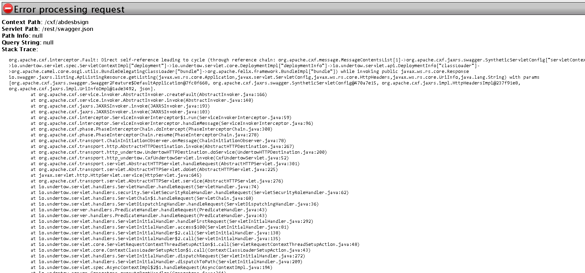

PROJECT TO DESCRIBE THE BUG  https://issues.apache.org/jira/browse/CXF-8116
=========================================================================================


### JIRA REFERENCE 

https://issues.apache.org/jira/browse/CXF-8116

### PRODUCUT

REDHAT FUSE KARAF version 7.3.1.fuse-731003-redhat-00003

OPENJDK openjdk version "1.8.0_212"


### ALL THE FEATURE INSTALLED ON RED HAT FUSE 

```

 feature:install instance
 feature:install cxf-commands
 feature:install log
 feature:install pax-cdi-weld
 feature:install ssh
 feature:install camel-cxf
 feature:install aries-blueprint
 feature:install cxf
 feature:install cxf-http-undertow
 feature:install patch
 feature:install cxf-rs-description-swagger2
 feature:install feature
 feature:install camel
 feature:install jaas
 feature:install camel-jaxb
 feature:install camel-paxlogging
 feature:install deployer
 feature:install diagnostic
 feature:install patch-management
 feature:install bundle
 feature:install kar
 feature:install camel-csv
 feature:install package
 feature:install scr
 feature:install maven
 feature:install war
 feature:install camel-mail
 feature:install fuse-credential-store
 feature:install framework
 feature:install system
 feature:install pax-http-undertow
 feature:install fuse-javaee-apis
 feature:install management
 feature:install camel-undertow
 feature:install camel-blueprint
 feature:install camel-spring
 feature:install hawtio
 feature:install camel-ftp
 feature:install fuse-credential-store-core
 feature:install config
 feature:install transaction-manager-narayana
feature:install camel-http4
feature:install camel-spring-security
feature:install camel-jms
feature:install camel-jackson
feature:install camel-jacksonxml
feature:install camel-restlet-jackson
feature:install camel-rest-swagger 
feature:install camel-swagger
feature:install camel-swagger-java
feature:install camel-jdbc
feature:install camel-quartz2
feature:install camel-hl7
feature:install camel-xmlsecurity
feature:install camel-tika
feature:install camel-undertow
feature:install camel-activemq
feature:install camel-netty4
feature:install spring-jdbc
feature:install spring-orm
feature:install spring-security
feature:install cxf-http-client
feature:install cxf-rs-description-openapi-v3
feature:install cxf-http-netty-client
feature:install cxf-http-netty-server
feature:install hibernate
feature:install pax-jdbc-pool-dbcp2
feature:install aries-blueprint-spring
features:install webconsole

```

### The Screenshot 



### The exception

```
org.apache.cxf.interceptor.Fault: Direct self-reference leading to cycle (through reference chain: org.apache.cxf.message.MessageContentsList[1]->org.apache.cxf.jaxrs.swagger.SyntheticServletConfig["servletContext"]->io.undertow.servlet.spec.ServletContextImpl["deployment"]->io.undertow.servlet.core.DeploymentImpl["deploymentInfo"]->io.undertow.servlet.api.DeploymentInfo["classLoader"]->org.apache.camel.core.osgi.utils.BundleDelegatingClassLoader["bundle"]->org.apache.felix.framework.BundleImpl["bundle"]) while invoking public javax.ws.rs.core.Response io.swagger.jaxrs.listing.ApiListingResource.getListing(javax.ws.rs.core.Application,javax.servlet.ServletConfig,javax.ws.rs.core.HttpHeaders,javax.ws.rs.core.UriInfo,java.lang.String) with params [org.apache.cxf.jaxrs.swagger.Swagger2Feature$DefaultApplication@7fc8f668, org.apache.cxf.jaxrs.swagger.SyntheticServletConfig@470a7e15, org.apache.cxf.jaxrs.impl.HttpHeadersImpl@237f91e8, org.apache.cxf.jaxrs.impl.UriInfoImpl@1ade3492, json].
	at org.apache.cxf.service.invoker.AbstractInvoker.createFault(AbstractInvoker.java:166)
	at org.apache.cxf.service.invoker.AbstractInvoker.invoke(AbstractInvoker.java:140)
	at org.apache.cxf.jaxrs.JAXRSInvoker.invoke(JAXRSInvoker.java:193)
	at org.apache.cxf.jaxrs.JAXRSInvoker.invoke(JAXRSInvoker.java:103)
	at org.apache.cxf.interceptor.ServiceInvokerInterceptor$1.run(ServiceInvokerInterceptor.java:59)
	at org.apache.cxf.interceptor.ServiceInvokerInterceptor.handleMessage(ServiceInvokerInterceptor.java:96)
	at org.apache.cxf.phase.PhaseInterceptorChain.doIntercept(PhaseInterceptorChain.java:308)
	at org.apache.cxf.phase.PhaseInterceptorChain.resume(PhaseInterceptorChain.java:278)
	at org.apache.cxf.transport.ChainInitiationObserver.onMessage(ChainInitiationObserver.java:78)
	at org.apache.cxf.transport.http.AbstractHTTPDestination.invoke(AbstractHTTPDestination.java:267)
	at org.apache.cxf.transport.http_undertow.UndertowHTTPDestination.doService(UndertowHTTPDestination.java:200)
	at org.apache.cxf.transport.http_undertow.CxfUndertowServlet.invoke(CxfUndertowServlet.java:52)
	at org.apache.cxf.transport.servlet.AbstractHTTPServlet.handleRequest(AbstractHTTPServlet.java:301)
	at org.apache.cxf.transport.servlet.AbstractHTTPServlet.doGet(AbstractHTTPServlet.java:225)
	at javax.servlet.http.HttpServlet.service(HttpServlet.java:645)
	at org.apache.cxf.transport.servlet.AbstractHTTPServlet.service(AbstractHTTPServlet.java:276)
	at io.undertow.servlet.handlers.ServletHandler.handleRequest(ServletHandler.java:74)
	at io.undertow.servlet.handlers.security.ServletSecurityRoleHandler.handleRequest(ServletSecurityRoleHandler.java:62)
	at io.undertow.servlet.handlers.ServletChain$1.handleRequest(ServletChain.java:68)
	at io.undertow.servlet.handlers.ServletDispatchingHandler.handleRequest(ServletDispatchingHandler.java:36)
	at io.undertow.server.handlers.PredicateHandler.handleRequest(PredicateHandler.java:43)
	at io.undertow.server.handlers.PredicateHandler.handleRequest(PredicateHandler.java:43)
	at io.undertow.servlet.handlers.ServletInitialHandler.handleFirstRequest(ServletInitialHandler.java:292)
	at io.undertow.servlet.handlers.ServletInitialHandler.access$100(ServletInitialHandler.java:81)
	at io.undertow.servlet.handlers.ServletInitialHandler$2.call(ServletInitialHandler.java:138)
	at io.undertow.servlet.handlers.ServletInitialHandler$2.call(ServletInitialHandler.java:135)
	at io.undertow.servlet.core.ServletRequestContextThreadSetupAction$1.call(ServletRequestContextThreadSetupAction.java:48)
	at io.undertow.servlet.core.ContextClassLoaderSetupAction$1.call(ContextClassLoaderSetupAction.java:43)
	at io.undertow.servlet.handlers.ServletInitialHandler.dispatchRequest(ServletInitialHandler.java:272)
	at io.undertow.servlet.handlers.ServletInitialHandler.dispatchToPath(ServletInitialHandler.java:209)
	at io.undertow.servlet.spec.AsyncContextImpl$2$1.handleRequest(AsyncContextImpl.java:194)
	at io.undertow.server.Connectors.executeRootHandler(Connectors.java:364)
	at io.undertow.servlet.spec.AsyncContextImpl$2.run(AsyncContextImpl.java:191)
	at io.undertow.servlet.spec.AsyncContextImpl$6.run(AsyncContextImpl.java:485)
	at io.undertow.servlet.spec.AsyncContextImpl$TaskDispatchRunnable.run(AsyncContextImpl.java:604)
	at java.util.concurrent.ThreadPoolExecutor.runWorker(ThreadPoolExecutor.java:1149)
	at java.util.concurrent.ThreadPoolExecutor$Worker.run(ThreadPoolExecutor.java:624)
	at java.lang.Thread.run(Thread.java:748)
Caused by: com.fasterxml.jackson.databind.exc.InvalidDefinitionException: Direct self-reference leading to cycle (through reference chain: org.apache.cxf.message.MessageContentsList[1]->org.apache.cxf.jaxrs.swagger.SyntheticServletConfig["servletContext"]->io.undertow.servlet.spec.ServletContextImpl["deployment"]->io.undertow.servlet.core.DeploymentImpl["deploymentInfo"]->io.undertow.servlet.api.DeploymentInfo["classLoader"]->org.apache.camel.core.osgi.utils.BundleDelegatingClassLoader["bundle"]->org.apache.felix.framework.BundleImpl["bundle"])
	at com.fasterxml.jackson.databind.exc.InvalidDefinitionException.from(InvalidDefinitionException.java:77)
	at com.fasterxml.jackson.databind.SerializerProvider.reportBadDefinition(SerializerProvider.java:1191)
	at com.fasterxml.jackson.databind.ser.BeanPropertyWriter._handleSelfReference(BeanPropertyWriter.java:944)
	at com.fasterxml.jackson.databind.ser.BeanPropertyWriter.serializeAsField(BeanPropertyWriter.java:721)
	at com.fasterxml.jackson.databind.ser.std.BeanSerializerBase.serializeFields(BeanSerializerBase.java:719)
	at com.fasterxml.jackson.databind.ser.BeanSerializer.serialize(BeanSerializer.java:155)
	at com.fasterxml.jackson.databind.ser.BeanPropertyWriter.serializeAsField(BeanPropertyWriter.java:727)
	at com.fasterxml.jackson.databind.ser.std.BeanSerializerBase.serializeFields(BeanSerializerBase.java:719)
	at com.fasterxml.jackson.databind.ser.BeanSerializer.serialize(BeanSerializer.java:155)
	at com.fasterxml.jackson.databind.ser.BeanPropertyWriter.serializeAsField(BeanPropertyWriter.java:727)
	at com.fasterxml.jackson.databind.ser.std.BeanSerializerBase.serializeFields(BeanSerializerBase.java:719)
	at com.fasterxml.jackson.databind.ser.BeanSerializer.serialize(BeanSerializer.java:155)
	at com.fasterxml.jackson.databind.ser.BeanPropertyWriter.serializeAsField(BeanPropertyWriter.java:727)
	at com.fasterxml.jackson.databind.ser.std.BeanSerializerBase.serializeFields(BeanSerializerBase.java:719)
	at com.fasterxml.jackson.databind.ser.BeanSerializer.serialize(BeanSerializer.java:155)
	at com.fasterxml.jackson.databind.ser.BeanPropertyWriter.serializeAsField(BeanPropertyWriter.java:727)
	at com.fasterxml.jackson.databind.ser.std.BeanSerializerBase.serializeFields(BeanSerializerBase.java:719)
	at com.fasterxml.jackson.databind.ser.BeanSerializer.serialize(BeanSerializer.java:155)
	at com.fasterxml.jackson.databind.ser.BeanPropertyWriter.serializeAsField(BeanPropertyWriter.java:727)
	at com.fasterxml.jackson.databind.ser.std.BeanSerializerBase.serializeFields(BeanSerializerBase.java:719)
	at com.fasterxml.jackson.databind.ser.BeanSerializer.serialize(BeanSerializer.java:155)
	at com.fasterxml.jackson.databind.ser.impl.IndexedListSerializer.serializeContents(IndexedListSerializer.java:119)
	at com.fasterxml.jackson.databind.ser.impl.IndexedListSerializer.serialize(IndexedListSerializer.java:79)
	at com.fasterxml.jackson.databind.ser.impl.IndexedListSerializer.serialize(IndexedListSerializer.java:18)
	at com.fasterxml.jackson.databind.ser.DefaultSerializerProvider._serialize(DefaultSerializerProvider.java:480)
	at com.fasterxml.jackson.databind.ser.DefaultSerializerProvider.serializeValue(DefaultSerializerProvider.java:319)
	at com.fasterxml.jackson.databind.ObjectWriter$Prefetch.serialize(ObjectWriter.java:1396)
	at com.fasterxml.jackson.databind.ObjectWriter._configAndWriteValue(ObjectWriter.java:1120)
	at com.fasterxml.jackson.databind.ObjectWriter.writeValue(ObjectWriter.java:950)
	at org.apache.camel.component.jackson.JacksonDataFormat.marshal(JacksonDataFormat.java:166)
	at org.apache.camel.processor.MarshalProcessor.process(MarshalProcessor.java:69)
	at org.apache.camel.processor.interceptor.TraceInterceptor.process(TraceInterceptor.java:181)
	at org.apache.camel.processor.interceptor.HandleFaultInterceptor.process(HandleFaultInterceptor.java:42)
	at org.apache.camel.processor.DelegateAsyncProcessor.process(DelegateAsyncProcessor.java:110)
	at org.apache.camel.processor.RedeliveryErrorHandler.process(RedeliveryErrorHandler.java:548)
	at org.apache.camel.processor.CamelInternalProcessor.process(CamelInternalProcessor.java:201)
	at org.apache.camel.processor.Pipeline.process(Pipeline.java:138)
	at org.apache.camel.processor.Pipeline.process(Pipeline.java:101)
	at org.apache.camel.processor.CamelInternalProcessor.process(CamelInternalProcessor.java:201)
	at org.apache.camel.component.cxf.jaxrs.CxfRsInvoker.asyncInvoke(CxfRsInvoker.java:95)
	at org.apache.camel.component.cxf.jaxrs.CxfRsInvoker.performInvocation(CxfRsInvoker.java:69)
	at org.apache.cxf.service.invoker.AbstractInvoker.invoke(AbstractInvoker.java:96)
	at org.apache.cxf.jaxrs.JAXRSInvoker.invoke(JAXRSInvoker.java:193)
	at org.apache.cxf.jaxrs.JAXRSInvoker.invoke(JAXRSInvoker.java:103)
	at org.apache.cxf.interceptor.ServiceInvokerInterceptor$1.run(ServiceInvokerInterceptor.java:59)
	at org.apache.cxf.interceptor.ServiceInvokerInterceptor.handleMessage(ServiceInvokerInterceptor.java:96)
	at org.apache.cxf.phase.PhaseInterceptorChain.doIntercept(PhaseInterceptorChain.java:308)
	at org.apache.cxf.transport.ChainInitiationObserver.onMessage(ChainInitiationObserver.java:121)
	at org.apache.cxf.transport.http.AbstractHTTPDestination.invoke(AbstractHTTPDestination.java:267)
	at org.apache.cxf.transport.http_undertow.UndertowHTTPDestination.doService(UndertowHTTPDestination.java:200)
	at org.apache.cxf.transport.http_undertow.UndertowHTTPHandler.handleRequest(UndertowHTTPHandler.java:123)
	at io.undertow.server.Connectors.executeRootHandler(Connectors.java:364)
	at io.undertow.server.HttpServerExchange$1.run(HttpServerExchange.java:830)
	... 3 more
	
	```
